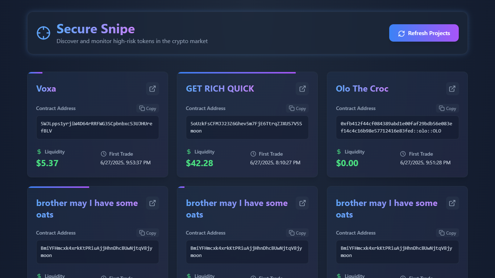

# Secure Snipe

**Secure Snipe** is a web application designed to help users discover and monitor high-risk tokens in the cryptocurrency market. It allows users to track key metrics such as liquidity, contract addresses, and trading history, offering them insights to make informed decisions about potential investments in volatile tokens.



## 🚀 Features

- **Token Monitoring**: Track real-time token liquidity and important trading data
- **Copy Contract Address**: Easily copy token contract addresses to explore further
- **Liquidity Tracking**: View token liquidity, providing insight into token stability
- **First Trade Information**: Get the exact timestamp of a token's first trade
- **External Link Integration**: Quickly open external platforms like DexScreener to analyze tokens in more detail
- **Responsive Design**: Optimized for both mobile and desktop devices
- **Real-time Refresh**: Update data with a single click
- **Modern UI**: Beautiful gradient design with smooth animations

## 🛠️ Tech Stack

### Frontend
- **React 18**: Modern UI library for building interactive interfaces
- **TypeScript**: Type-safe JavaScript for better code quality and maintainability
- **Tailwind CSS**: Utility-first CSS framework for fast styling
- **Vite**: Fast build tool and development server
- **Lucide React**: High-quality icons for the user interface

### Backend
- **Node.js**: JavaScript runtime environment
- **Express.js**: Web application framework
- **Jest**: Testing framework for both frontend and backend

## 📋 Prerequisites

Before running this application, make sure you have the following installed:

- **Node.js** (v16 or higher)
- **npm** (comes with Node.js)

## 🚀 Installation & Setup

### 1. Clone the Repository

```bash
git clone https://github.com/YassineFaidi/Secure-Snipe.git
cd Secure-Snipe
```

### 2. Install Dependencies

Install dependencies for both client and server:

```bash
# Install client dependencies
cd Client
npm install

# Install server dependencies
cd ../Server
npm install
```

### 3. Start the Application

You'll need to run both the client and server. Open two terminal windows:

**Terminal 1 - Start the Server:**
```bash
cd Server
node server.js
```

The server will start on `http://localhost:3000`

**Terminal 2 - Start the Client:**
```bash
cd Client
npm run dev
```

The client will start on `http://localhost:5173`

### 4. Access the Application

Open your browser and navigate to `http://localhost:5173` to view the application.

## 📖 Usage

1. **View Projects**: The application automatically loads and displays high-risk tokens with liquidity under $50
2. **Refresh Data**: Click the "Refresh Projects" button to fetch the latest data
3. **Copy Address**: Click the "Copy" button next to any contract address to copy it to your clipboard
4. **External Analysis**: Click the external link icon to open the token on DexScreener for detailed analysis
5. **Monitor Liquidity**: The top gradient bar shows the liquidity percentage relative to the $50 threshold

## 🏗️ Project Structure

```
Secure-Snipe/
├── Client/                 # Frontend React application
│   ├── src/
│   │   ├── components/     # React components
│   │   ├── types.ts        # TypeScript type definitions
│   │   ├── App.tsx         # Main application component
│   │   └── index.css       # Global styles
│   ├── package.json        # Frontend dependencies
│   └── vite.config.ts      # Vite configuration
├── Server/                 # Backend Node.js application
│   ├── controllers/        # API controllers
│   ├── routes/            # API routes
│   ├── services/          # Business logic services
│   ├── tests/             # Backend tests
│   ├── package.json       # Backend dependencies
│   └── server.js          # Main server file
├── image.png              # Application screenshot
└── README.md              # This file
```

## 🧪 Testing

### Frontend Tests
```bash
cd Client
npm test
```

### Backend Tests
```bash
cd Server
npm test
```

## 🚀 Available Scripts

### Client Scripts
- `npm run dev` - Start development server
- `npm run build` - Build for production
- `npm run preview` - Preview production build
- `npm test` - Run tests
- `npm run lint` - Run ESLint

### Server Scripts
- `node server.js` - Start the server
- `npm test` - Run tests
- `npm run lint` - Run ESLint

## 🔧 Configuration

The application uses the following default configurations:

- **Frontend Port**: 5173 (Vite default)
- **Backend Port**: 3000
- **API Endpoint**: `http://localhost:3000/projects`

## 🤝 Contributing

Contributions to the project are welcome! If you'd like to contribute, follow these steps:

1. **Fork the repository**
2. **Create a new branch**: `git checkout -b feature/your-feature-name`
3. **Make your changes** and commit: `git commit -am 'Add new feature'`
4. **Push to the branch**: `git push origin feature/your-feature-name`
5. **Create a pull request**

### Development Guidelines

- Follow the existing code style and conventions
- Write tests for new features
- Update documentation as needed
- Ensure all tests pass before submitting a PR

## 📝 License

This project is licensed under the MIT License - see the [LICENSE](LICENSE) file for details.

## 🙏 Acknowledgements

- **Lucide** for providing high-quality icons
- **Tailwind CSS** for a flexible and customizable styling framework
- **React** for the efficient UI development
- **Vite** for the fast development experience
- **Express.js** for the robust backend framework

## 📞 Support

If you encounter any issues or have questions:

1. Check the [Issues](https://github.com/yourusername/Secure-Snipe/issues) page
2. Create a new issue with detailed information about your problem
3. Include steps to reproduce the issue and your environment details

## 🔄 Version History

- **v1.0.0** - Initial release with basic token monitoring functionality
- Features: Token discovery, liquidity tracking, contract address copying, external links

---

**Note**: This application is designed for educational and research purposes. Always do your own research before making any investment decisions in the cryptocurrency market.
